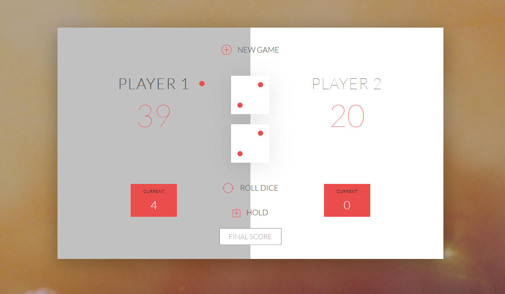

# Roll Dice Game

This project is about a roll dice game. Please read down below for the rules. Enjoy the Game!.

## GAME RULES:

- The game has 2 players, playing in rounds.
- In each turn, a player rolls a dice as many times as he whishes. 
Each result get added to his ROUND score.
- BUT, if the player rolls a 1, all his ROUND score gets lost. 
After that, it's the next player's turn.
- The player can choose to 'Hold', which means that his ROUND score 
gets added to his GLOBAL score. After that, it's the next player's turn.
- The first player to reach 100 points on GLOBAL score wins the game.

## Images

## Try the game 

[Click on this link to play the game](https://alejandrotoledoweb.github.io/roll-dice-game/)

## Languages

I build this project as part of my journey learning JAVASCRIPT.
 I built this repo using:

 - HMTL
 - CSS
 - JAVASCRIPT

 ## Author

👤 **Alejandro Toledo**

- GitHub: [@alejandrotoledoweb](https://github.com/alejandrotoledoweb)
- Twitter: [@alejot](https://twitter.com/alejot) 
- LinkedIn: [Alejandro Toledo](https://www.linkedin.com/in/alejandro-toledo-3b444b109/) 

## 🤝 Contributing

Contributions, issues and feature requests are welcome!

Feel free to check the [issues page](https://github.com/alejandrotoledoweb/roll-dice-game/issues).

## Show your support

Give a ⭐️ if you like this project!

## 📝 License

This project is [MIT](https://opensource.org/licenses/MIT) licensed.

